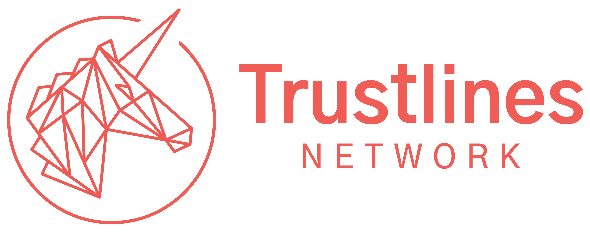

# Welcome to Trustlines Docs

___
## Introduction

Here you can find information and documentation relating to Trustlines.

### Background

The Trustlines Stiftung (Foundation) was set up to support the protocol development for the Trustlines Network. Since there has been in the past and will probably continue to be efforts relating to the Trustlines Network outside of the Foundation, there might be confusion about naming and communication in general. This document aims at providing general guidelines for anyone involved in the Trustlines Network, be that as part of work for the community, open-source developers and other interested parties.

### The Trustlines Network

The Trustlines Network ecosystem describes the ecosystem of individuals, projects, and entities aligned toward the idea of mapping trust-based relationships on to trustless infrastructure. Sometimes this is also simply referred to as the Trustlines Network. No single entity owns, is, or can be, in charge of this construct.

### The Trustlines Protocol

The Trustlines Protocol represents a set of rules, processes, and definitions forged into deployable code, which aims to enable the mapping of trust-based relationships on to trustless infrastructure, e.g. a blockchain.

More specifically, the Trustlines Protocol implementation will include the components used to calculate paths and store transactions:

-   The Trustlines Blockchain, which is a mPoS (minimal viable Proof of Stake) sidechain to Ethereum and stores transactions 

-   The relay servers, which calculate the optimal paths and relay the transactions sent by applications they are connected to

-   The client library, a high-level API, which enables applications to interact with the smart contract system on the Trustlines Blockchain via the relay servers

-   The smart contract system which includes the currency networks and other smart contacts supporting currency network related transactions, e.g. identity contract(s)

## Official communication Channels
-------------------------------

!!! failure ""
    **Websites**

    <https://trustlines.network/>

    <https://trustlines.foundation/>

!!! abstract ""
    **Trustlines Foundation Twitter**

    <https://twitter.com/TrustlinesFound>

    <https://twitter.com/tl_validator>

!!! abstract ""
    **Trustlines Foundation Medium Blog**

    <https://medium.com/trustlines-foundation>

!!! failure ""
    **Trustlines Subreddit**

    <https://www.reddit.com/r/trustlines>

!!! abstract ""
    **Trustlines Protocol Reddit account**

    <https://www.reddit.com/user/TrustlinesProtocol/>

!!! bug ""
    **Trustlines Network Community (unofficial) Telegram**

    <https://t.me/trustlines_network>

!!! failure ""
    **Trustlines Technical Chat on Gitter**

    <https://gitter.im/trustlines/community>

!!! abstract ""
    **Trustlines YouTube channel**

    <https://www.youtube.com/channel/UCdNvItQZDL8Qj0HJGIM_AYA> 
