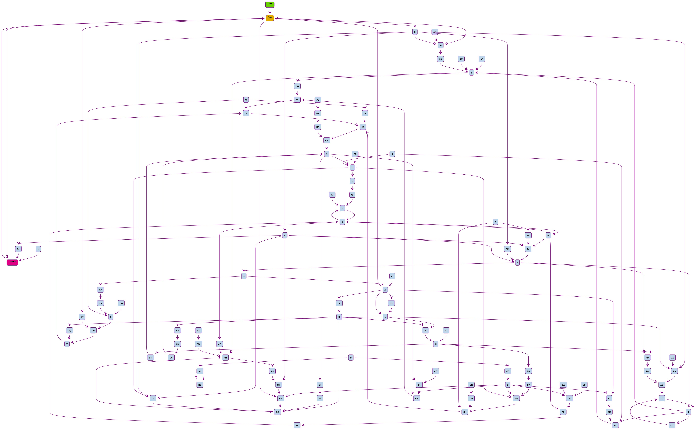
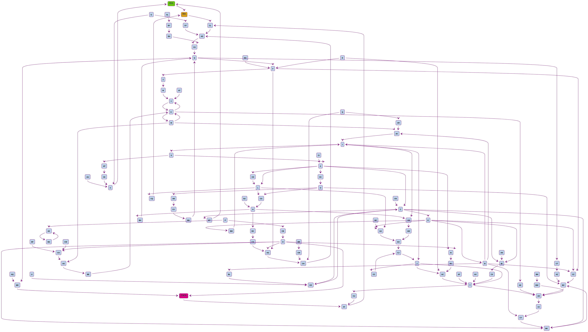
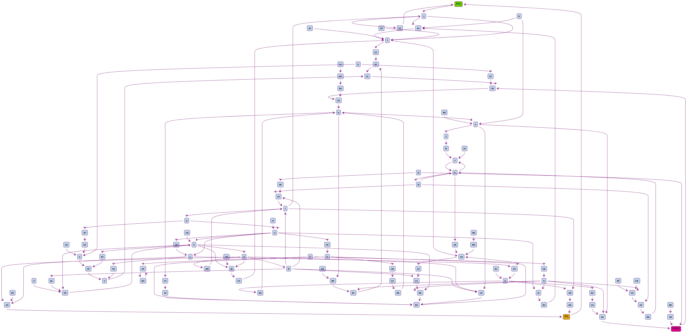
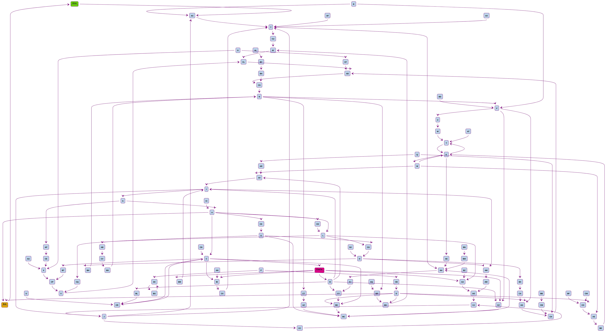
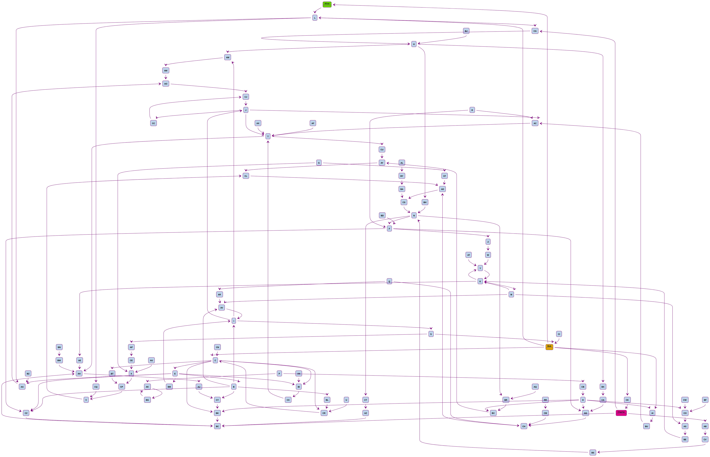
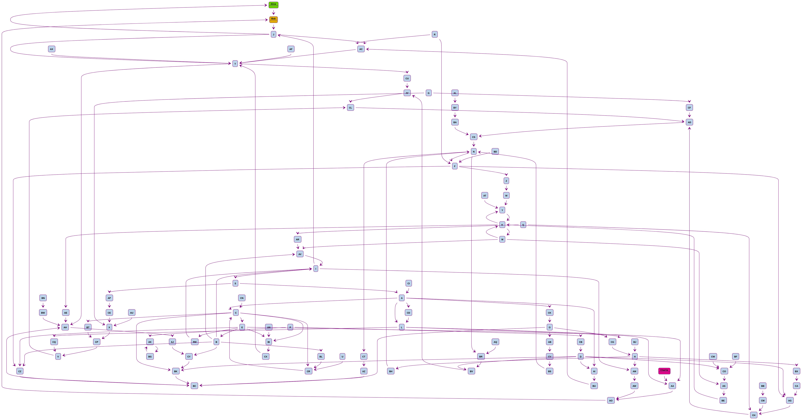
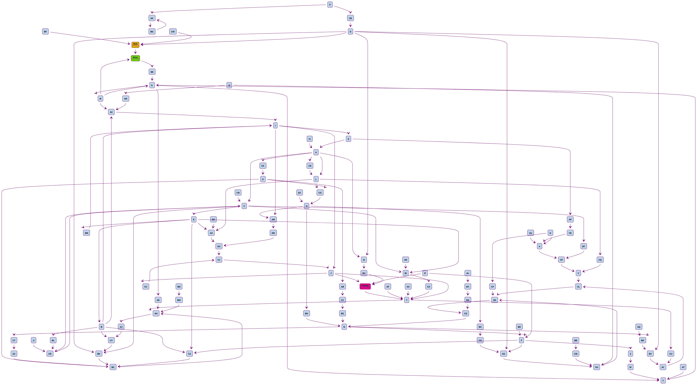
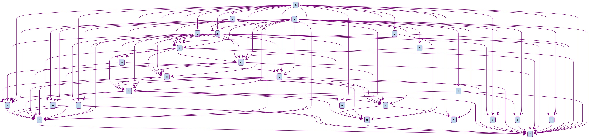

## Concept validation

Trustlines should be decentralized and claims that only a handful of nodes connected to a handful of other nodes is sufficient to create a large decentralized network in which each network member can find another one.

**Method**

We take a sufficient amount of participants where each one is connected to a minimum of one other node.

Each connection is randomly selected from the pool of nodes.

Some connections might have a loop between each other since every connection was randomly chosen and no steps were taken to ensure that no looping takes place.

__Note__: trustlines are always between two nodes, the graph shows arrow indicators for the purpose of who might have initiated a connection, and so that we can verify that every node has at least one connection to another node.

### Directly connected participants

**Method**

Total participants: 100

5 nodes are connected to a minimum of 5 nodes

10 nodes are connected to a minimum of 3 nodes

5 nodes are connected to a minimum of 2 nodes

#### **Alice** is directly connected to **Bob** who is directly connected to **Charlie**.

### Participants connected randomly

**Method**

Total participants: 100

5 nodes are connected to a minimum of 5 nodes

10 nodes are connected to a minimum of 3 nodes

5 nodes are connected to a minimum of 2 nodes

#### **Alice** is directly connected to **Bob** who might be connected to **Charlie**.
There **may** or **may not** be a path from Alice to Charlie.

This would most likely be the closest to a real world situation where we have a handful of nodes connected to a handful of nodes, but no guarantees are made between Alice and Charlie.

### Participants connected with 1 hop

**Method**

Total participants: 100

5 nodes are connected to a minimum of 5 nodes

10 nodes are connected to a minimum of 3 nodes

5 nodes are connected to a minimum of 2 nodes

#### **Alice** is directly connected to **Bob** who is connected to **Charlie** with 1 hop in between.

Here we ensure that there is exactly 1 hop between Bob and Charlie.

### Participants connected with multiple hops

**Method**

Total participants: 100

5 nodes are connected to a minimum of 5 nodes

10 nodes are connected to a minimum of 3 nodes

5 nodes are connected to a minimum of 2 nodes

#### **Alice** is directly connected to **Bob** who is connected to **Charlie** with multiple hops in between.

Here we ensure that Bob and Charlie are connected to each other via multiple hops.

### Bonus example

An example of some company in some country that possibly has 25 employees who mostly work in two different offices and have certain people who most people trust and people mostly trust the others working at the same office :)

